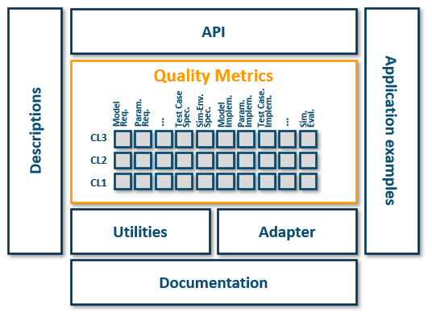

# Credibility Development Kit

The Credibility Development Kit (CDK) is initiated in the ITEA3 project "UPSIM" as part of the Credibility Assessment Framework.
It provides reusable, transparent quality metrics for a credibility assessment, following the SETLevel Credible Simulation Process (CSP)[^1].

Overall, we distinguish between 3 Credibility Levels. The CDK will provide metrics for each level for each phase and step of the CSP.

Further, it will provide additional components:

* **Descriptions, Documentation**: Descriptions of what Quality Metrics aim to measure and additional code documentation, using JSDoc.
* **Utilities**: A collection of reusable helper functions that are used across different Quality Metrics with the purpose to have reproducible, traceable procedures, e.g., on how data is pre/post-processed.
* **Adapters**: A collection of functions that transform individual input data structures (may be standardized data structures like SSD or proprietary formats) into the data structures expected by the Quality Metrics implementations as an input.
* **API**: Facades as entry points to control pre-defined workflows, automatically using the correct adapters for individual Quality Metrics
* **Application examples**: Collection of best practices of proposed and former usage of Quality Metrics

[^1]: https://gitlab.setlevel.de/open/processes_and_traceability/credible_simulation_process_framework
