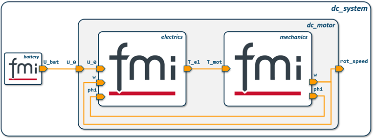

# SSD-ADAPTER

This adapter can be used to translate a System Structure Definition (SSD), which is defined within the System Structure and Parametrization standard (SSP)[^1], into the CDK target format for analyzing a system simulation structure.

In detail, the target format extracts system elements, connectors and connections of the SSD:

* elements: All subsystems and components used within the defined system, indicating the element name, the element type (System or Component), the element's source file, the enclosing subsystem pedigree of the element and the number of the layer where the element is used
* connectors: All connectors of the elements, indicating the connector's name, the element the connector belongs to, the kind of the connector (like input or output), the data type of the connector and the subsystem pedigree of the connector
* connections: All connections used in the system, indicating the start and end element as well as the start and end connectors of the connection, as well as the subsystem pedigree the connection is used in


## Usage

The path of the system's representation as an SSD file must be passed to the translation function

```javascript
const ssdPath = "./path_to_ssd_file.ssd";
const systemStructureCdk = translate(ssdPath);
```

it will return a stringified JSON, according to the [target schema](#schema). In case an error occurs, the error message will be written to the resulting JSON string, as the only existing property, for instance:

```javascript
{"error":"Could not open specified SSD file"}
```

The translate function will check:
* if the SSD path is valid `{error : "Could not open specified SSD file"}`
* if the XML structure of the SSD file is valid `{error : "Parsing of SSD not possible, due to invalid XML structure"}`
* if the SSD file implements the according XSD specification `{error : "Parsing of SSD not possible, due to invalid implementation of the given XSD structure"}`

If each of this is the case, the function will return a valid translation.

## Example

Consider the following example of a simple system for a DC motor:

.

The representation of this system structure according to the SSD specification can be viewed [here](./examples/dc_motor_example.ssd).

If we pass its path to the translate function, like in the follwing

```javascript
const { translate } = require("../.");

const ssdPath = "./examples/dc_motor_example.ssd";
const systemStructureCdk = translate(ssdPath);
```

the resulting target structure will look like [this](./examples/dc_motor_example_result.json).

For using an interactive example use 
```
npm run example
```
in your terminal

## Schema

The resulting format will consist of three arrays, indicating a list of system elements, connectors and connections as a stringifed JSON that fulfills the following schema:

```json
schema = {
    "type": "object",
    "properties": {
        "elements": {
            "type": "array",
            "items": {
                "type": "object",
                "properties" : {
                    "name": { 
                        "type": "string"
                    },
                    "type": {
                        "type": "string",
                        "enum": ["System", "Component"],
                    },
                    "source": {
                        "type": "string"
                    },
                    "subsystem": {
                        "type": "array",
                        "items": {
                            "type": "string"
                        }
                    }       
                }
            }
        },
        "connectors": {
            "type": "array",
            "items": {
                "type": "object",
                "properties" : {
                    "subsystem": {
                        "type": "array",
                        "items": {
                            "type": "string"
                        }
                    },
                    "name": { 
                        "type": "string"
                    },
                    "element": {
                        "type": "string"
                    },
                    "kind": {
                        "type": "string",
                        "enum": ["input", "output", "inout", "paramter", "calculatedParameter"]
                    },
                    "type": {
                        "type": "string",
                        "enum": ["Real", "Integer", "Boolean", "String", "Enumeration"]
                    }          
                }
            }
        },
        "connections": {
            "type": "array",
            "items": {
                "type": "object",
                "properties" : {
                    "subsystem": {
                        "type": "array",
                        "items": {
                            "type": "string"
                        }
                    },
                    "element_start": { 
                        "type": "string"
                    },
                    "element_end": {
                        "type": "string"
                    },
                    "name_start": {
                        "type": "string"
                    },
                    "name_end": {
                        "type": "string"
                    }          
                }
            }
        }
    }
}
```
[^1]: https://ssp-standard.org/