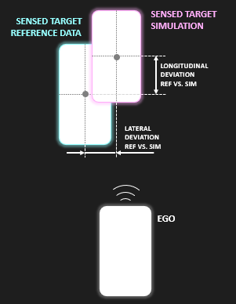

# Sensor Model Deviation

This quality metric is used to evaluate the performance of an object-based sensor model by comparing a desired quantity (longitudinal position, lateral position, yaw orientation, yaw rate, longitudinal velocity, or lateral velocity) between the real reference data and the outputs of the re-simulated scene; specifically, the sensed position of a distinctive target vehicle (bounding-box center point) is compared.



## Description

The quality metric is used for validation of the sensor model, thus it consumes some reference data, re-simulates the scene of the reference data and compares the reference data against the simulation results. The re-simulation is executed open-loop, which means the captured GroundTruth data, extracted from the SensorData input, is fed to the sensor model.

1. Extract SensorView messages from the SensorData trace of the real data
2. Setup the simulation, based on the extracted SensorView data:
    - configure required number of steps
    - set mounting position
    - set filepaths (SensorView input, sensor model, SensorData output)
3. Perform the simulation, based on [OpenMCx](https://github.com/eclipse-openmcx/openmcx/tree/main).
4. Extract the desired quantity (e.g. position) of the desired target vehicle from both SensorData files (reference and simulation)
5. Compare the desired quantity between reference and simulation and perform the desired reduction method (e.g. RMSE)
6. Compare the final value to the configured threshold value to derive if the test has been passed or failed

## Inputs

This quality metric expects 2 input datasets: 
- OSMP sensor model
- OSI SensorData traces

### Input 1: OSMP Sensor Model

The **OSI-compliant sensor model (OSMP)** is the system under test.
The sensor model must fulfill certain requirements to guarantee the execution and correct quality metric calculation:
- Provide one **SensorView input**
- Provide one **SensorData output**, providing at least [the listed signals](./doc/required_output_signals.md)
- Provide the [ASAM OSI 3.7.0](https://github.com/OpenSimulationInterface/open-simulation-interface/tree/v3.7.0) library as position independent code (no shared library)
- Provide the [Google protobuf](https://github.com/protocolbuffers/protobuf) library (3.6.1 or higher) as position independent code (no shared library)
- Provide the following parameters to parametrize the mounting position of the sensor:
    - **name:** mounting_position_x, **unit:** m
    - **name:** mounting_position_y, **unit:** m
    - **name:** mounting_position_z, **unit:** m
    - **name:** mounting_position_yaw, **unit:** rad
    - **name:** mounting_position_pitch, **unit:** rad
    - **name:** mounting_position_roll, **unit:** rad

### Input 2: OSI SensorData traces

The **OSI SensorData traces** file provides reference data (e.g., real-world data, or data from a benchmark simulation) that is compared against the outputs of the re-simulation (using the OSMP Sensor Model) of the captured scene. 
To allow for a re-simulation and to enable the aspired comparison, the SensorData traces must fulfill the following requirements:
- Be compliant to [ASAM OSI 3.7.0](https://github.com/OpenSimulationInterface/open-simulation-interface/tree/v3.7.0)
- Provide [the listed signals](./doc/required_input_signals.md) for each timestep

## Parameters

The following parameters are used to configure the quality metric and quality criterion:
- `target_quantity` (**type:** string): The desired quantity to compare. Must be one of the following:
    - `longitudinal_position`
    - `lateral_position`
    - `longitudinal_velocity`
    - `lateral_velocity`
    - `yaw_orientation`
    - `yaw_rate`
- `reduction_method` (**type** string): The desired n-to-1 reduction method to derive one final value form the time-series. Must be one of the following:
    - `rmse` ([root mean squared error](https://en.wikipedia.org/wiki/Root_mean_square_deviation))
    - `mae` ([mean absolute error](https://en.wikipedia.org/wiki/Mean_absolute_error))
    - `mse` ([mean squared error](https://en.wikipedia.org/wiki/Mean_squared_error))
    - `max` ([maximum](https://en.wikipedia.org/wiki/Maximum_and_minimum))
- `target_vehicle_id` (**type:** integer): The ground truth ID (sensor_view.global_ground_truth.moving_object.id) of the moving object you want to use for comparing the position
- `allowed_deviation` (**type:** float): The allowed deviation between simulation and reference to pass the test

## Usage

### OVAL

If you want to register this quality metric as an algorithm on [OVAL](https://oval.pepro.io/), run the following command to build the required images:
```bash
./build_image.sh --dist oval --user <your docker hub username>
```
Register both created images in the Docker Hub Registry.

Example for user `jondoequalitymaster`
```bash
./build_image.sh --dist oval --user jondoequalitymaster
docker push jondoequalitymaster/sensor_model_deviation_metric
docker push jondoequalitymaster/sensor_model_deviation_oval
```
And register the `sensor_model_deviation_oval` image in the OVAL ecosystem.

Make sure to register the [configuration parameters](#parameters) as algorithm custom data!

### Arbitrary environment

To run the quality metric in your arbitrary environment, run the following command to build the required images:
```bash
./build_image.sh --dist local
```

To run the metric in your environment, execute the following command:
```bash
docker run --rm -it -v /path/to/your/mounted_folder:/data sensor_model_deviation_local
```
Change the mounted volume */path/to/your/mounted_folder* to the folder that contains your input data, using the following structure:
```
mounted_folder/
 ├───────── inputs/
 │           ├──── 20250704T133000Z_sd_370_3200_1234_reference_data_example.osi    # OSI SensorData traces file (reference data)
 │           ├──── sensor_model.fmu                                                # OSMP sensor model
 │           ├──── parameters.json                                                 # JSON file containing the parameters (see above)
```
After successful execution of the quality metric, the outputs folder will contain the following files
```
mounted_folder/
 ├───────── inputs/
 │           ├──── ...
 ├───────── outputs/   
 │           ├──── result.txt                                           # Final result of the quality metric execution containing a boolean value
 │           ├──── log.txt                                              # Further information about the quality metric execution
 │           ├──── raw/
 │                  ├──── simulation/
 │                          ├──── 20250704T135147Z_sd_370_361_1234.osi  # Re-simulated SensorData
 │                          ├──── simulation.log                        # Simulation-specific log (openmcx)
```
Make sure to provide the [configuration parameters](#parameters) (see an [example](./doc/parameters_example.json))