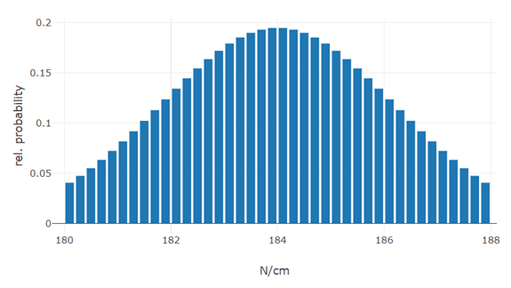
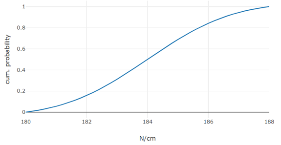
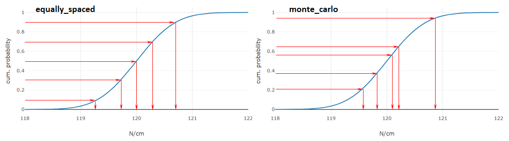

# PARAMETER

The Parameter package provides wrappers for simulation parameters, as well as methods to generate samples, in case the parameter values are represented as uncertain values.

* [`ScalarParameter`](#scalarparameter)
* [`createSamples`](#createsamples)

## `ScalarParameter`

There are three essential types that a ScalarParameters can represent, with respect to the uncertainty of the parameter's value:

- **discrete**: No uncertainty applied. There is absolute certainty about the parameter value as given.
    - *Example: The number of pole pairs of an electric motor. Whatever value is given to test specific designs of the motor, the parameter will not vary.*

- **epistemic**: Uncertainty due to *lack of knowledge or data*. Uncertainty can be reduced if more knowledge or data is added. A parameter with epistemic uncertainty is given in a range of values, without knowing the actual distribution of the values inside the range. 
    - *Example: The temperature range of a vehicle. As the manufacturer sells cars to countries located at cold areas and hot areas, the temperature range is assumed to be between a safe range of T=[-30, 50] °C. If field data from users is analyzed, a better approximation of the parameter could be obtained.*

- **aleatory**: Uncertainty due to *inherent variation*. Uncertainty is not reduced as more data is gathered. A parameter with aleatory uncertainty is expressed as a (truncated) distribution.
    - *Example: The mass moment of inertia of a shaft, used in series production. In a series of samples of the shaft, the value of the moment of inertia will differ slightly, due to tolerances in the production. However, the distribution of the values is known and converged after measuring a lot of samples. The parameter is given as minimum, nominal and maximum value and a standard deviation: J_nom=0.85 kgm², J_min=0.842 kgm², J_max=0.856 kgm², σ=0.04 kgm². Measuring more samples would not result in a more exact approximation of the distribution.*

### Usage

1. [Instantiation](#instantiation)
2. [Get properties](#property-getters)  
3. [Set properties](#property-setters)
4. [Probability Distributions](#probability-distributions) 

### Instantiation

`new ScalarParameter(...)`

To instantiate a ScalarParameter, the following arguments must be passed:
* a nominal value
* a config object to further describe the parameter

The `config` object must at least specify a name for the parameter:

```javascript
config = {
    name: "drag coefficient"
};

parameter = new ScalarParameter(0.34, config);
```

Other values are optional. A parameter unit can be specified and follows the [conventions from the mathjs library](https://mathjs.org/docs/datatypes/units.html#reference). If an interval is indicated, parameter values will be rounded to the nearest number that is dividable by the interval.

**We recommend to always provide an interval, otherwise 0.001 will be set as default interval!**

```javascript
parameter = new ScalarParameter(204.74, {
    name: "spring stiffness",
    unit: "N/cm",
    interval: 0.2
}); // nominal value will be set to 204.8 N/cm
```

If only the nominal value is given, the parameter will be treated as *discrete* value. However, in technical systems discrete values only make sense for a limited scope of parameters (e.g., the number of pole pairs in an electric motor will not have any uncertainty).

A parameter represents **epistemic uncertainty**, by adding a value range. The value range can be given as individual boundaries or as symmetric tolerances around the nominal value, analogously to the approach in the referenced paper of Otter et al.[^1].

```javascript
parameter = new ScalarParameter(1720, {
    name: "vehicle mass",
    unit: "kg",
    interval: 1,
    lower_limit = 1625,
    upper_limit = 1950
}); // epistemic - nominal value: 1720 kg, limits: [1625, 1950] kg

parameter = new ScalarParameter(20, {
    name: "temperature range",
    unit: "degC",
    interval: 0.5,
    tolerance_absolute: 10
}); // epistemic - nominal value: 20 °C, limits: [10, 30] °C

parameter = new ScalarParameter(40, {
    name: "resistance",
    unit: "Ohm",
    interval: 1e-2,
    tolerance_relative: 0.05
}); // epistemic - nominal value: 40 Ohm, limits: [38, 42] Ohm
```

If a standard deviation is added on top, the parameter represents an **aleatory uncertainty**. Currently, the distribution can only be represented as a [truncated normal distribution](https://en.wikipedia.org/wiki/Truncated_normal_distribution) (more to follow). Again, the representation is analogously to the approach in the referenced paper of Otter et al.[^1].

```javascript
parameter = new ScalarParameter(0.34, {
    name: "drag coefficient",
    lower_limit = 0.32,
    upper_limit = 0.37,
    standard_deviation = 0.012
}); // aleatory - nominal value: 0.34, limits: [0.32, 0.37], stddev: 0.012

parameter = new ScalarParameter(204.8, {
    name: "spring stiffness",
    unit: "N/cm",
    interval: 0.1,
    tolerance_absolute: 4.4,
    standard_deviation = 2.6
}); // aleatory - nominal value: 204.8, limits: [200.4, 209.2] N/cm, stddev: 2.6 N/cm

parameter = new ScalarParameter(34.84, {
    name: "damper constant",
    unit: "N/(m/s)",
    interval: 1e-2,
    tolerance_relative: 0.025,
    standard_deviation_factor = 2 // stddev = tolerance / stddev_factor = 0.025 * 34.84 / 2
}); // aleatory - nominal value: 34.84 Ns/m, limits: [33.97, 35.71] Ns/m, stddev: 0.436 Ns/m
```

Additionally, meta-information on the origin of the nominal value and uncertainty (limits and/or standard deviation) can be given. 
Possible values for the sources are *unknown*, *estimated*, *provided*, *computed*, *measured*, or *calibrated*

```javascript
parameter = new ScalarParameter(0.34, {
    name: "drag coefficient",
    interval: 1e-3,
    tolerance_absolute: 0.025,
    standard_deviation_factor: 2,
    source_value: "computed", 
    source_uncertainty: "estimated"
});
```

### Property Getters

Consider the following parameter:
```javascript
parameter = new ScalarParameter(204.8217, {
    name: "spring stiffness",
    unit: "N/cm",
    interval: 0.1,
    tolerance_absolute: 2.5,
    standard_deviation: 1.4,
    source_value: "measured",
    source_uncertainty: "estimated"
})
```

A ScalarParameter object provides the following getters:

`nominal_value`
```javascript
parameter.nominal_value // 204.8
```

`limits`
```javascript
parameter.limits // [202.3, 207.3]
```

`unit`
```javascript
parameter.unit // "N/cm"
```

`interval`
```javascript
parameter.interval // 0.1
```

`uncertainty_type`
```javascript
parameter.uncertainty_type // "truncated_normal" (other values: "fixed", "range")
```

`uncertainty_classification`
```javascript
parameter.uncertainty_classification // "aleatory" (other values: "discrete", "epistemic")
```

`standard_deviation`
```javascript
parameter.standard_deviation // 1.4
```

`source_value`
```javascript
parameter.source_value // "measured"
```

`source_uncertainty`
```javascript
parameter.source_uncertainty // "estimated"
```

### Property Setters

A ScalarParameter object provides the following setters. Using the property setters, **the interval of the parameter is applied** for parameter values.
For a better understanding, consider again the parameter that is given in the getter description:

`nominal_value`
```javascript
parameter.nominal_value = 205.47 // set to 205.5
```

`limits`
```javascript
parameter.limits = [201.68, 209.441] // set to [201.7, 209.4]
```

`lower_limit`
```javascript
parameter.lower_limit = 201.974 // set to 202.0
```

`upper_limit`
```javascript
parameter.lower_limit = 209.11 // set to 209.1
```

`unit`
```javascript
parameter.unit = "N/cm" // no automatic conversion is applied!
```

`interval`
```javascript
parameter.interval = 0.2 // sets nominal value to 205.6 and limits to [201.8, 209.4]
```

`tolerance_absolute`
```javascript
parameter.tolerance_absolute = 2.92 // will reset limits to [202.6, 208.6]
```

`tolerance_relative`
```javascript
parameter.tolerance_relative = 0.02 // will reset limits to [201.4, 209.8]
```

`standard_deviation`
```javascript
// standard deviation is not fixed at interval boundaries!
parameter.standard_deviation = 1.65
```

`standard_deviation_factor`
```javascript
// standard deviation is not fixed at interval boundaries!
parameter.standard_deviation_factor = 2 // will set standard deviation to 2.056
```

`source_value`
```javascript
parameter.source_value = "calibrated"
```

`source_uncertainty`
```javascript
parameter.source_uncertainty = "computed"
```

### Probability Distributions

The ScalarParameter class provides automatic generation of probability distributions:

`calcPdf`

If a standard distribution of the parameter is given, `calcPdf` returns values of the [probability density function](https://en.wikipedia.org/wiki/Probability_density_function).

Currently, for PDFs, only [truncated normal distributions](https://en.wikipedia.org/wiki/Truncated_normal_distribution) are supported.

```javascript
parameter = new ScalarParameter(184, {
    name: "spring stiffness",
    unit: "N/cm",
    interval: 0.1,
    tolerance_absolute: 4.0,
    standard_deviation: 2.2,
});

nSamples = 40;
pdf = parameter.calcPdf(nSamples);

// pdf
// {
//     type: "PDF",
//     x: [180.1, 180.3, 180.5, ..., 187.7, 187.9],
//     p: [0.04047, 0.04735, 0.05495, ..., 0.04735, 0.04047],
//     unit: "N/cm"
// }
```



The x property indicates the parameter values. As this is a **discrete** representation of the PDF, the x-ticks are to be interpreted as middlepoints of an interval. Thus, the first sample in the upper example represents the probability that a value is between 180.0 and 180.2.

Indicating the desired number of samples is optional. If the number of samples is not indicated or higher than the maximum possible number of samples (based on the interval of the parameter. In the upper case: 2*4.0/0.1 = 80), the number of samples will be chosen to the maximum possible number. Further, due to performance reasons, the sample number is limited to 10000 samples.

`calcCdf`

If a standard distribution of the parameter is given, `calcCdf` returns discrete values of the [cumulative distribution function](https://en.wikipedia.org/wiki/Cumulative_distribution_function).

Currently, for CDFs, only [truncated normal distributions](https://en.wikipedia.org/wiki/Truncated_normal_distribution) are supported.

```javascript
// parameter as given in calcPdf

nSamples = 41;
cdf = parameter.calcCdf(nSamples);

// cdf
// {
//     type: "CDF",
//     x: [180.0, 180.2, 180.4, ..., 187.8, 188.0],
//     p: [0,  0.008100, 0.01758, ..., 0.9919, 1],
//     unit: "N/cm"
// }
```



Unlike for the discrete PDF, the x-ticks of the CDF indicate boundaries, so the third sample in our example indicates that the probability of the parameter being below 180.4 is 1.758%.

Indicating the desired number of samples is optional. If the number of samples is not indicated or higher than the maximum possible number of samples (based on the interval of the parameter. In the upper case: 2*4.0/0.1 + 1 = 81), the number of samples will be chosen to the maximum possible number. Further, due to performance reasons, the sample number is limited to 10001 samples.

## `createSamples`

Especially for uncertainty quantifications, we need to extract samples from the parameters. The `createSamples` function returns an experimental design that is tailored to design of experiments for uncertainty quantifications.

### Usage

The function expects either a single ScalarParameter or a ScalarParameter array. A configuration which gives the desired number of samples and the desired sampling method must be given.

For understanding the usage, consider the following list of parameters:

```javascript
aleatoryParameter1 = new ScalarParameter(40, {
    name: 'spring stiffness constant c',
    unit: 'N/cm',
    interval: 0.01,
    tolerance_absolute: 2,
    standard_deviation_factor: 2,
});

aleatoryParameter2 = new ScalarParameter(20, {
    name: "operating temperature",
    unit: "degC",
    interval: 0.1,
    lower_limit: -30,
    upper_limit: 50,
    standard_deviation: 12
});

epistemicParameter1 = new ScalarParameter(1680, {
    name: "vehicle mass m",
    unit: "kg",
    interval: 1,
    lower_limit: 1550,
    upper_limit: 1800
});

epistemicParameter2 = new ScalarParameter(0.55, {
    name: "front-axle load, relative",
    unit: "-",
    interval: 0.01,
    lower_limit: 0.47,
    upper_limit: 0.59
});

discreteParameter = new ScalarParameter(2, {
    name: "number of passengers"
});
```
To just create samples from one parameter, just pass a ScalarParameter, next to the configuration object.
Currently, **equally_spaced** and **monte_carlo** sampling methods are available (more to be added, soon).

```javascript
samples = createSamples(epistemicParameter1, {
    samples: 6,
    method: "equally_spaced"
});

// samples
// {
//     names: [ 'vehicle mass m'],
//     units: [ 'kg' ],
//     values: [ [[1750]], [[1600]] [[1550]], [[1800]], [[1700]], [[1650]] ]
// }
```
The dimension of the values property is as follows: \[nE, nR, nP\], with nE is indicating the number of interrelated experiments, nR the number of runs per experiment and nP the total number of parameters; where nE depends on the number of parameters with epistemic uncertainties and nR depends on the number of parameters with aleatory uncertainties.

The parameter values are always shuffled, when using *equally_spaced* as sampling method, to avoid correlation with other parameters, when combined.

When passing a parameter with aleatory uncertainty, the sampling works different. Sampling is done for the cumulated probability first (sampling from 0 to 1) and then transfered to the the parameter values (e.g., by applying the inverse cumulated probability function), as illustrated in the following picture:



```javascript
samples = createSamples(aleatoryParameter1, {
    samples: 6,
    method: "monte_carlo"
});

// samples
// {
//   names: [ 'spring stiffness constant c' ],
//   units: [ 'N/cm' ],
//   values: [ [[39.69]], [[39.85]], [[39.49]], [[41.17]], [[41.97]], [[39.8]] ]
// }
```

If we combine two or more parameters of the same uncertainty classification (*epistemic* / *aleatory*), the values are simply combined:

```javascript
samples = createSamples([aleatoryParameter1, aleatoryParameter2], {
    samples: 6,
    method: "equally_spaced"
});

// samples
// {
//   names: [ 'spring stiffness constant c', 'operating temperature' ],
//   units: [ 'N/cm', 'degC' ],
//   values: [
//   [
//     [ 40.64, 3.4 ],
//     [ 39.36, 27.9 ],
//     [ 40.2, 11.8 ],
//     [ 39.8, 22.4 ],
//     [ 41.27, 17.4 ],
//     [ 38.73, 36.2 ]
//   ]
// ]
// }
```
The correct assignment of values to parameters can be read from the names property (in this example the first value of a parameter combination refers to the spring stiffness, the second to the operating temperature).

If parameters of different uncertainty classifications are passed to `createSamples`, the sampling for each type of uncertainty will be separated[^2], i.e. each epistemic sample is applied to each aleatory sample. Therefore the sampling method and number of samples must be given:

```javascript
samples = createSamples([epistemicParameter1, aleatoryParameter1, aleatoryParameter2], {
    samples_aleatory: 5,
    samples_epistemic: 3,
    method_aleatory: "equally_spaced",
    method_epistemic: "monte_carlo"
});

// samples
// {
//   names: [
//     'vehicle mass m'
//     'spring stiffness constant c',
//     'operating temperature',
//     
//   ],
//   units: [ 'kg', 'N/cm', 'degC' ],
//   values: [
//     [
//       [ 1631, 40, 13.6 ],
//       [ 1631, 38.82, 26.1 ],
//       [ 1631, 40.5, 19.9 ],
//       [ 1631, 39.5, 35 ],
//       [ 1631, 41.18, 4.6 ]
//     ],
//     [
//       [ 1679, 40, 13.6 ],
//       [ 1679, 38.82, 26.1 ],
//       [ 1679, 40.5, 19.9 ],
//       [ 1679, 39.5, 35 ],
//       [ 1679, 41.18, 4.6 ]
//     ],
//     [
//       [ 1610, 40, 13.6 ],
//       [ 1610, 38.82, 26.1 ],
//       [ 1610, 40.5, 19.9 ],
//       [ 1610, 39.5, 35 ],
//       [ 1610, 41.18, 4.6 ]
//     ]
//   ]
// }
```
If a parameter with a fixed value is added to the parameter array, its value will be simply appended:

```javascript
samples = createSamples([discreteParameter, epistemicParameter1, aleatoryParameter1, aleatoryParameter2], {
    samples_aleatory: 5,
    samples_epistemic: 3,
    method_aleatory: "equally_spaced",
    method_epistemic: "monte_carlo"
});

// samples
// {
//   names: [
//     'vehicle mass m'
//     'spring stiffness constant c',
//     'operating temperature',
//     'number of passengers'
//     
//   ],
//   units: [ 'kg', 'N/cm', 'degC', '-' ],
//   values: [
//     [
//       [ 1631, 40, 13.6, 2 ],
//       [ 1631, 38.82, 26.1, 2 ],
//       [ 1631, 40.5, 19.9, 2 ],
//       [ 1631, 39.5, 35, 2 ],
//       [ 1631, 41.18, 4.6, 2 ]
//     ],
//     [
//       [ 1679, 40, 13.6, 2 ],
//       [ 1679, 38.82, 26.1, 2 ],
//       [ 1679, 40.5, 19.9, 2 ],
//       [ 1679, 39.5, 35, 2 ],
//       [ 1679, 41.18, 4.6, 2 ]
//     ],
//     [
//       [ 1610, 40, 13.6, 2 ],
//       [ 1610, 38.82, 26.1, 2 ],
//       [ 1610, 40.5, 19.9, 2 ],
//       [ 1610, 39.5, 35, 2 ],
//       [ 1610, 41.18, 4.6, 2 ]
//     ]
//   ]
// }
```

[^1]: Otter, Martin et al. (2022). Towards Modelica Models with Credibility Information. *Electronics 2022, 11(17), 2728; Subsection 3*. DOI: [10.3390/electronics11172728](https://www.mdpi.com/2079-9292/11/17/2728)

[^2]: Christopher John Roy, William L. Oberkampf (2010). A Complete Framework for Verification, Validation, and Uncertainty Quantification in Scientific Computing (Invited). *In: 48th AIAA Aerospace Sciences Meeting Including the New Horizons Forum and Aerospace Exposition.* Orlando, USA. DOI: 10.2514/6.2010-124
