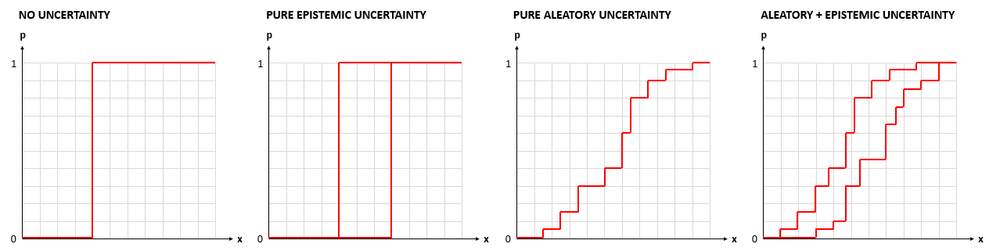
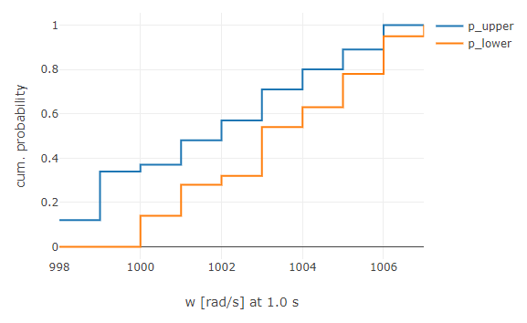
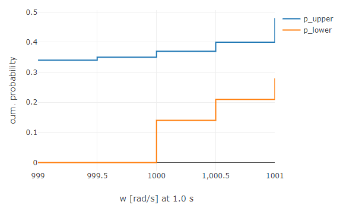
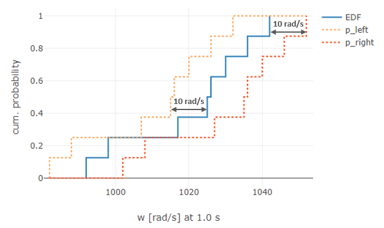
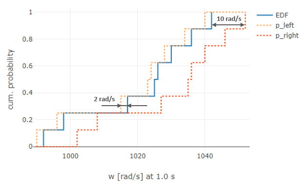
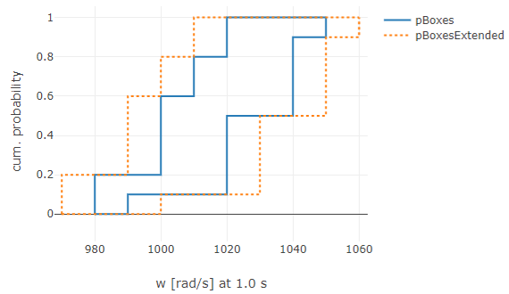

# UNCERTAINTY

The Uncertainty package provides methods to quantify the uncertainty behind simulation results.

As an overview, based on the nature of the inherent uncertainty, there are different possibilities of quantifying uncertainties in empirical data (e.g., simulation results or reference data) by means of cumulative probability distributions:



- If no uncertainty is present, the probability is represented by a step function from 0 to 1 (a discrete value with 100% belief).

- If only epistemic uncertainties are present, the probabilities are represented by two 0-to-1 step functions, representing the lower and upper bound of all samples.

- If only aleatory uncertainties are present, the data is consisting of at least two samples, resulting in a step function that jumps up by 1/n at each of the n samples (commonly known as [*Empirical Distribution Function (EDF)*](https://en.wikipedia.org/wiki/Empirical_distribution_function)).

- If both aleatory and epistemic uncertainties are present, several EDFs are reduced to a probability representation of only EDFs, where the left EDF is representing the lower bound of all EDFs and the right EDF is representing the upper bound of all EDFs (commonly known as [*Probability Boxes*](https://en.wikipedia.org/wiki/Probability_box)).

For creating these representations, the following utilities are provided:

* [`createEmpiricalDistribution`](#createempiricaldistribution)
* [`createPBoxes`](#createpboxes)
* [`addUncertainty`](#adduncertainty)
* [`addUncertainty`](#adduncertainty)

## `createEmpiricalDistribution`

To create empirical distributions from simulation results, the function `createEmpiricalDistribution` can be used. It will generate a distribution function, commonly known as *Empirical Distribution Function (EDF)*, or *Cumulative Empirical Distribution Function (cEDF)*.

In simulation context, EDFs can be used to characterize simulation results or reference data with pure aleatory uncertainty.

### Usage

To create an EDF, an array of discrete values can be passed to the function:

```javascript
discreteValues = [1036.1, 998.5, 1030.8, 1026.0, 1017.2, 1025.3, 1042.8, 992.7];
edf = createEmpiricalDistribution(discreteValues);

// edf
// {
//     type: "CDF",
//     x: [992.7, 998.5, 1017.2, 1025.3, 1026.0, 1030.8, 1036.1, 1042.8],
//     p: [0.125, 0.25, 0.375, 0.5, 0.625, 0.75, 0.875, 1],
//     unit: "unknown"
// }
```

The recommended way of using `createEmpiricalDistribution` is to use an array of [Signals](https://github.com/virtual-vehicle/Credibility-Assessment-Framework/tree/main/Credibility-Development-Kit/util/signal) with a corresponding evaluation function, that will return a number:

```javascript
discreteValues = [signal1, signal2, signal3, signal4, signal5]; // rotational speed of a DC motor
evalFn = signal => signal.value(1.0) - 1000; // the difference of the rotational speed at 1.0 seconds to 1000 rad/s

edf = createEmpiricalDistribution(discreteValues, evalFn);

// edf
// {
//     type: "CDF",
//     x: [-9.3, 11.2, 19.6, 27.7, 49.3],
//     p: [0.2, 0.4, 0.6, 0.8, 1],
//     unit: "rad/s"
// }
```

## `createPBoxes`

The function is used to create [*Probability Boxes*](https://en.wikipedia.org/wiki/Probability_box) that can be used to characterize the uncertainty of simulation results including aleatory **and** epistemic uncertainties. The approach to use it for simulation results has been proposed by C. Roy and W. Oberkampf [^1].

### Usage

The `createPBoxes` function expects an array of [cumulative distributions](#createempiricaldistribution), where each cumulative distribution represents empirical data (simulation results or reference data), that have been parametrized with **a single epistemic parameter combination** and **several aleatory parameter samples** (each point of the cumulative distribution represents a data sample of a specific parameter combination of the parameters with aleatory uncertainties, i.e. one array element from the first dimension generated with the [`createSamples` function of the Parameter module](https://github.com/virtual-vehicle/Credibility-Assessment-Framework/tree/main/Credibility-Development-Kit/util/parameter#createsamples)).

If only the array of cumulative distributions is passed, the returned data points will be chosen to have only significant values (only those data points where a step occurs; no redundant data):

```javascript
edfs = [edf1, edf2, edf3, edf4];
pBoxes = createPBoxes(edfs);

// pBoxes
// {
//     x: [991, 999, 1006, 1009, 1012, 1013, 1014, 1018, 1027, 1039],
//     p_left: [0.12, 0.34, 0.37, 0.48, 0.57, 0.71, 0.85, 0.96, 1, 1],
//     p_right: [0, 0.04, 0.14, 0.28, 0.32, 0.54, 0.63, 0.78, 0.95, 1],
//     unit: "rad/s",
// }
```



The minimum, maximum and interval values can be specified, optionally, by passing these values to the function via a configuration object.

If the minimum and maximum values are specified not generously enough, it's likely that the whole range from 0 to 1 is not covered.

```javascript
edfs = [edf1, edf2, edf3, edf4, edf5, edf6];
config = {
    x_min: 999,
    x_max: 1001,
    interval: 0.5
};

pBoxes = createPBoxes(edfs, config);

// pBoxes
// {
//     x: [999, 999.5, 1000, 1000.5, 1001],
//     p_left: [0.34, 0.34, 0.37, 0.40, 0.48],
//     p_right: [0, 0, 0.14, 0.21, 0.28],
//     unit: "rad/s",
// }
```



## `addUncertainty`

This function can be used to add (epistemic) uncertainty to an EDF or P-Boxes (e.g. originating from numerical uncertainty). `addUncertainty` will always return P-Boxes.

### Usage

The minimum information to provide is an EDF and a numerical value for the uncertainty to add. In this case the uncertainty is added to both sides of the EDF.

```javascript
edf = {
    type: "CDF",
    x: [992, 998, 1017, 1025, 1026, 1030, 1036, 1042],
    p: [0.125, 0.25, 0.375, 0.5, 0.625, 0.75, 0.875, 1],
    unit: "rad/s"
};

pBoxes = addUncertainty(edf, 10);

// pBoxes
// {
//     x: [982, 988, 1002, 1007, 1008, 1015, 1016, 1020, 1026, 1027, 1032, 1035, 1036, 1040, 1046, 1052],
//     p_left: [0.125, 0.25, 0.25, 0.375, 0.375, 0.5, 0.625, 0.75, 0.875, 0.875, 1, 1, 1, 1, 1, 1],
//     p_right: [0, 0, 0.125, 0.125, 0.25, 0.25, 0.25, 0.25, 0.25, 0.375, 0.375, 0.5, 0.625, 0.75, 0.875, 1],
//     unit: 'rad/s'
// }
```



Uncertainty can be added selectively to the left and right side, by passing an array, where the first value represents the uncertainty that will be added to the left and the second value represents the uncertainty that will be added to the right side:

```javascript
edf = {
    type: "CDF",
    x: [992, 998, 1017, 1025, 1026, 1030, 1036, 1042],
    p: [0.125, 0.25, 0.375, 0.5, 0.625, 0.75, 0.875, 1],
    unit: "rad/s"
};

pBoxes = addUncertainty(edf, [2, 10]);

// pBoxes
// {
//     x: [990,  996, 1002, 1008, 1015, 1023, 1024, 1027, 1028, 1034, 1035, 1036, 1040, 1046, 1052],
//     p_left: [0.125, 0.25, 0.25, 0.25, 0.375, 0.5, 0.625, 0.625, 0.75, 0.875, 0.875, 0.875, 1, 1, 1],
//     p_right: [0, 0, 0.125, 0.25, 0.25, 0.25, 0.25, 0.375, 0.375, 0.375, 0.5, 0.625, 0.75, 0.875, 1],
//     unit: 'rad/s'
// }
```



The same way P-Boxes can be extended by an uncertainty:

```javascript
pBoxes = {
    x: [980, 990, 1000, 1010, 1020, 1040, 1050],
    p_left: [0.2, 0.2, 0.6, 0.8, 1, 1, 1],
    p_right: [0, 0.1, 0.1, 0.1, 0.5, 0.9, 1],
    unit: "rad/s"
};

pBoxesExtended = addUncertainty(pBoxes, 10);

// pBoxesExtended
// {
//     x: [970, 980, 990, 1000, 1010, 1020, 1030, 1050, 1060],
//     p_left: [0.2, 0.2, 0.6, 0.8, 1, 1, 1, 1, 1],
//     p_right: [0, 0, 0, 0.1, 0.1, 0.1, 0.5, 0.9, 1],
//     unit: 'rad/s'
// }
```



As can be seen in the data of `pBoxesExtended`, there are redundant samples (x: 980 with p_left: 0.2 and p_right: 0 is the same sample as x: 970. The same counts for x: 1010 and x:1020). To avoid this, the third argument of the function `keepIntervals` must be set to `false`. The information degree will remain the same, but all redundant samples will drop out of the arrays:

```javascript
pBoxes = {
    x: [980, 990, 1000, 1010, 1020, 1040, 1050],
    p_left: [0.2, 0.2, 0.6, 0.8, 1, 1, 1],
    p_right: [0, 0.1, 0.1, 0.1, 0.5, 0.9, 1],
    unit: "rad/s"
};

pBoxesExtended = addUncertainty(pBoxes, 10, false);

// pBoxesExtended
// {
//     x: [970, 990, 1000, 1010, 1030, 1050, 1060],
//     p_left: [0.2, 0.6, 0.8, 1, 1, 1, 1],
//     p_right: [0, 0, 0.1, 0.1, 0.5, 0.9, 1],
//     unit: 'rad/s'
// }
```


[^1]: Christopher John Roy, William L. Oberkampf (2010). "A Complete Framework for Verification, Validation, and Uncertainty Quantification in Scientific Computing" (Invited). *In: 48th AIAA Aerospace Sciences Meeting Including the New Horizons Forum and Aerospace Exposition.* Orlando, USA. DOI: 10.2514/6.2010-124