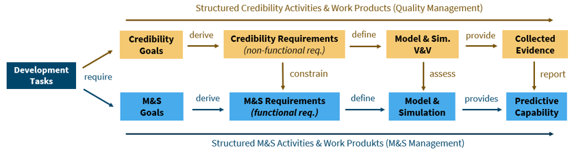

# Credibility-Assessment-Framework

The *Credibility Assessment Framework* is a systematic approach to assess the **credibility** of Models and Simulations.

The **credibility** of Models and Simulations is achieved by its collected evidence through ...
- ... a structured approach for ensuring work products
- ... a risk-based definition of the credibility goals
- ... a definition of credibility requirements by a credibility argumentation
- ... transparent implementation of Models and Simulations and a corresponding verification and validation strategy

The *Credibility Assessment Framework* implements the [SETLevel Credible Simulation Process Framework](https://gitlab.setlevel.de/open/processes_and_traceability/credible_simulation_process_framework) and allows to assess the credibility of a model or a simulation by using **Credibility Levels**:
- Credibility Level 0: No credibility
- Credibility Level 1: Low credibility
- Credibility Level 2: Medium credibility 
- Credibility Level 3: High credibility

A model or simulation receives a **Credibility Level** by carrying out the following steps:
1. [**A Capability Assessment**](./Capability-Assessment/README.md): A proof of the publisher(s) of the model or simulation to have implemented the [*Credible Simulation Process*](https://gitlab.setlevel.de/open/processes_and_traceability/credible_simulation_process_framework/-/blob/main/Credible-Simulation-Process-v1-3.pdf), using the future [*M&S SPICE Assessment*](https://incose.onlinelibrary.wiley.com/doi/10.1002/iis2.13029)
2. [**A Quality Assessment**](./Credibility-Development-Kit/README.md): Performing corresponding quality assurance, using a structured [*artifact quality assessment*](https://ecp.ep.liu.se/index.php/modelica/article/view/572)

To certify a model or simulation carrying a specific **Credibility Level**, both, the capability and quality must fulfill the corresponding level:

